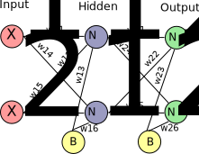

# A simple neural network
***

The simple neural network consists of **two input, two hidden, and two output neurons**:_

_

The input **(x_1, x_2)** are data points drawn from two different Gaussians with mean and covariance **((1, 1), diag(1 1)) and ((5, 5), diag(1 1))**, respectively.
The output neurons **N_21 and N_22** define where the point is predicted to belong to class A or B, depending on which neuron has a higher output. The loss function is the squared error of the predictions, where the desired output is (1, 0), or (0, 1), depending on the class.

The implemented algorithm is classic backpropagation using stochastic gradient descent. The loss function is the sum of squared errors over all outputs, and all neurons use the sigmoid as their activation function
